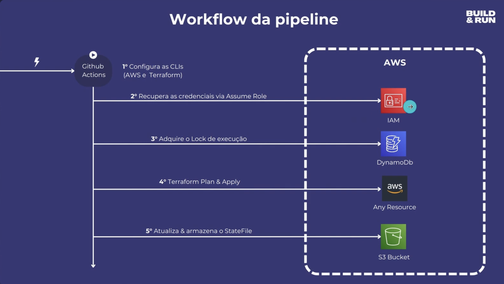

# tf-infra-pipeline

Este projeto implementa uma infraestrutura como código utilizando Terraform, com um pipeline automatizado no GitHub Actions para deploy e destroy de componentes AWS, separados por ambientes (`dev` e `prd`).

## Estrutura do Projeto

- **infra/**: Contém os arquivos Terraform para provisionamento da infraestrutura.
  - `main.tf`, `provider.tf`, `variables.tf`, `backend.tf`: Definições principais do Terraform.
  - `envs/dev/terraform.tfvars` e `envs/prd/terraform.tfvars`: Variáveis específicas para cada ambiente.
  - `destroy_config.json`: Controla se o pipeline deve executar o destroy dos recursos em cada ambiente.
- **assets/**: Imagens e diagramas do projeto.
  - `workflow.png`: Diagrama do pipeline.
- **.github/workflows/**: Workflows do GitHub Actions (não exibido acima, mas esperado no projeto real).

## Pipeline CI/CD

O pipeline é disparado automaticamente em push para os branches `main` (produção) e `develop` (desenvolvimento). Ele executa as seguintes etapas:

1. **Checkout do código**
2. **Setup do Terraform**
3. **Configuração das credenciais AWS via OIDC**
4. **Leitura do arquivo `infra/destroy_config.json`** para decidir se será feito deploy ou destroy.
5. **Terraform Init** com backend remoto S3 e DynamoDB para lock.
6. **Terraform Validate**
7. **Terraform Destroy** (se configurado no `destroy_config.json`)
8. **Terraform Plan & Apply** (caso não seja destroy)

## Como Usar

### Pré-requisitos

- Conta AWS com roles e recursos necessários para o backend remoto.
- Secrets e permissões configuradas no GitHub para OIDC.

### Deploy

- Push no branch `develop` executa deploy no ambiente de desenvolvimento.
- Push no branch `main` executa deploy no ambiente de produção.

### Destroy

- Para destruir recursos de um ambiente, altere o valor correspondente para `true` no arquivo `infra/destroy_config.json`.

## Personalização

- Edite `infra/envs/dev/terraform.tfvars` e `infra/envs/prd/terraform.tfvars` para alterar variáveis dos ambientes.
- Ajuste o arquivo `infra/variables.tf` para adicionar novas variáveis.

## Estrutura dos Workflows

- `terraform.yml`: Workflow principal reutilizável (esperado em `.github/workflows/`).
- `main.yml`: Pipeline de produção.
- `develop.yml`: Pipeline de desenvolvimento.

## Diagrama

---

Sinta-se à vontade para adaptar conforme necessário!
